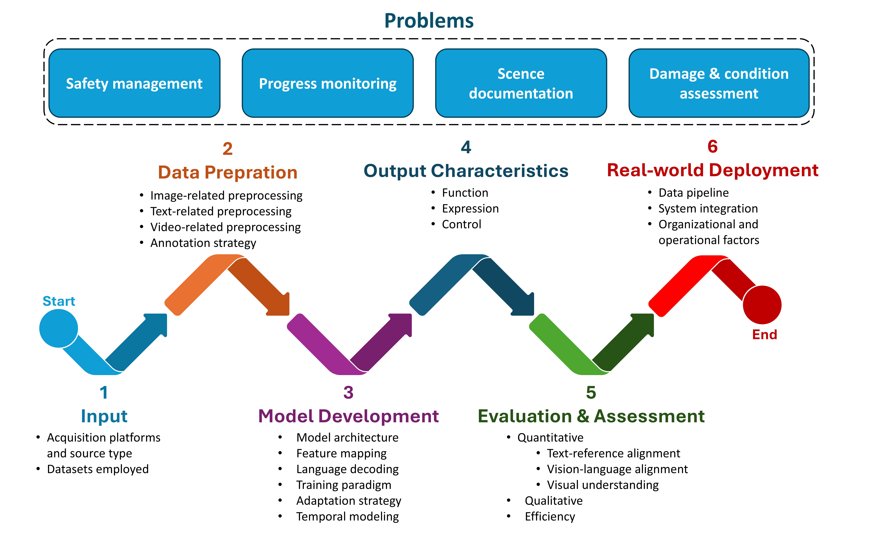

# Bridging Vision and Language in Construction

## 📌 Overview
This repository accompanies the paper:

**Bridging Vision and Language in Construction: A Review of Visual-to-Text Generation**

It presents a systematic search and review of visual-to-text generation in construction, here we share raw search results, code for identifying relevant studies, and supplementary analyses of the findings.
for details please refer to:

## 📄 Paper
- Title: *Bridging Vision and Language in Construction: A Scoping Review of Automated Image–Video Captioning*  
- Status: Under review  
- Link: *[Add link here]*

---

## 📊 Repository Structure

- `data/` — raw search results and processed datasets  
- `code/` — scripts for analysis  
- `figures/` — workflow and paper figures  
- `supplementary/` — additional materials  

---

## 🔍 Workflow
This repository follows the workflow presented in the paper, covering:

- Construction problems  
- Input data and acquisition  
- Data preparation  
- Model development  
- Output characteristics  
- Evaluation and assessment  
- Real-world deployment  

---

## 📎 Notes
- Raw search data are provided for reproducibility  
- Analysis scripts support transparency of the review process  
- Supplementary materials extend the results reported in the paper  

---

## 📬 Contact
For questions or collaboration, please open an issue or contact the author.
